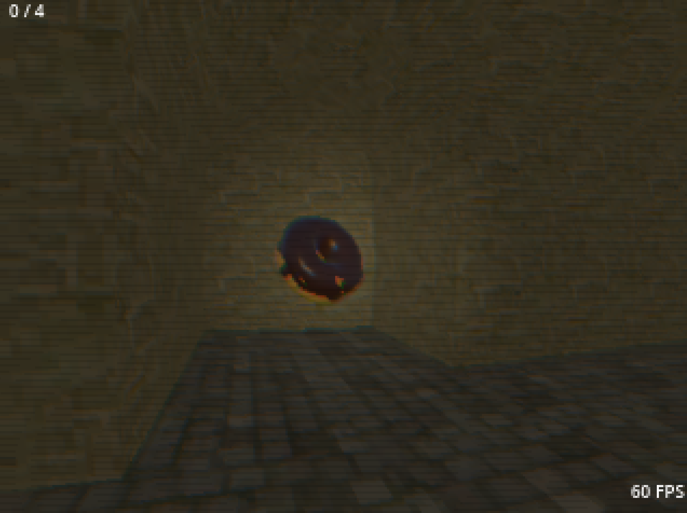

# Low poly dungeon test

Godot 4 scene trying to reproduce a PS1 / N64 scenario using fog, low poly meshes, low detail textures and resolution of 320x240. However, the donut is a [high poly model](https://epergo.com/posts/blender-donut/donut.gif) done while learning Blender. Not everything from the model imports as it should in Godot, geometry nodes are left out.

CRT shader from [SimpleGodotCRTShader](https://github.com/henriquelalves/SimpleGodotCRTShader)

